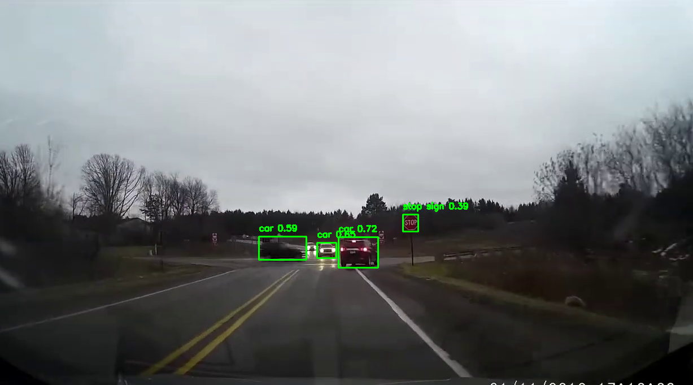
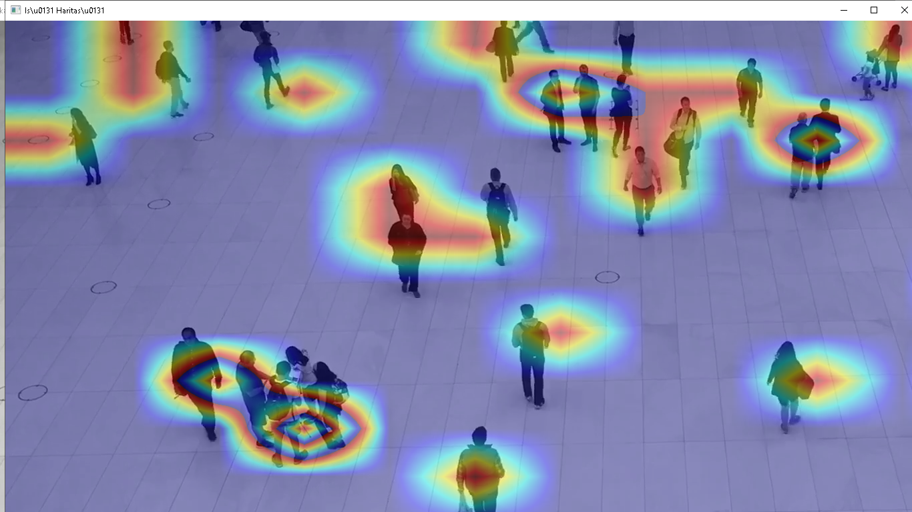
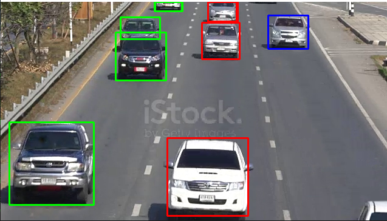
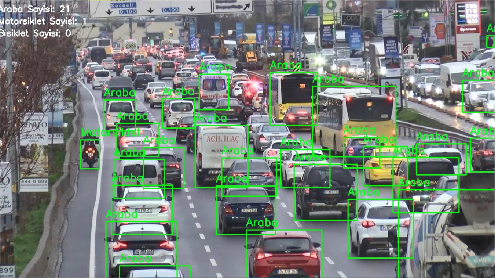
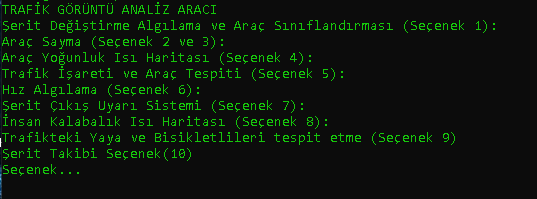
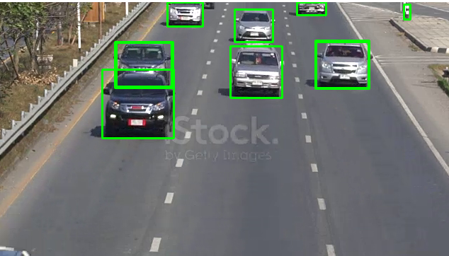
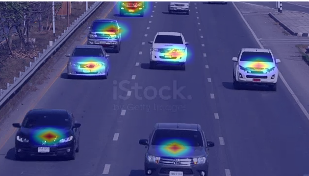

# Trafik Görüntü Analizi Aracı

Bu proje, görüntü işleme ve nesne tanıma tekniklerini kullanarak trafikteki araçları algılamak ve çeşitli trafik senaryolarını analiz etmek için geliştirilmiştir.

## Özellikler

- Şerit değişimi algılama ve araç sınıflandırması
- Araç sayma
- Araç yoğunluk ısı haritası oluşturma
- Trafik işareti ve araç tespiti
- Hız algılama
- Şerit çıkış uyarı sistemi
- İnsan kalabalık ısı haritası oluşturma
- Trafikteki yaya ve bisikletlileri tespit etme

## Kullanım

1. Ana menüden yapmak istediğiniz işlemi seçin.
2. İlgili seçeneği seçtikten sonra gerekli parametreleri ayarlayın.
3. Programı çalıştırın ve sonuçları izleyin.

## Gereksinimler

- Python 3.x
- OpenCV
- NumPy
- PyTorch
- YOLOv5

## Kurulum

1. Python'u [resmi web sitesinden](https://www.python.org/) indirip kurun.
2. Gerekli kütüphaneleri yüklemek için terminale pip komutunu kullanarak gerekli kütüpaheneleri indirin

##PROJE GÖRSELLERİ

